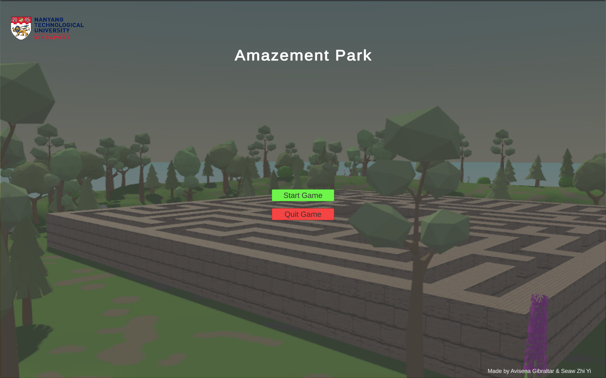
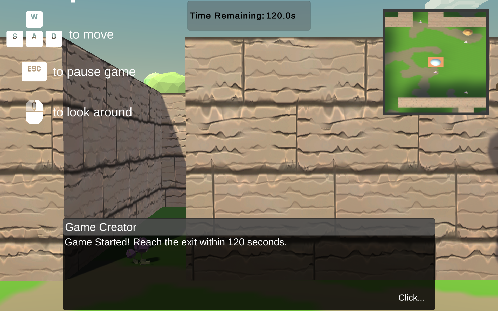
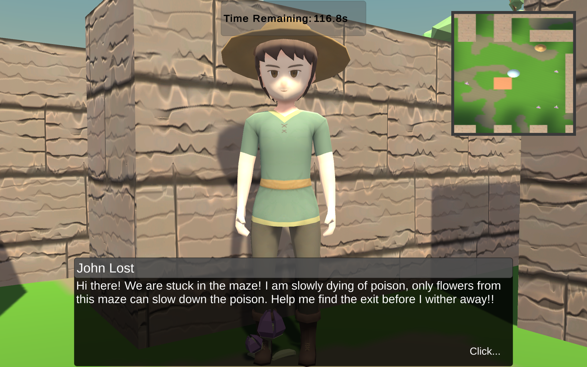
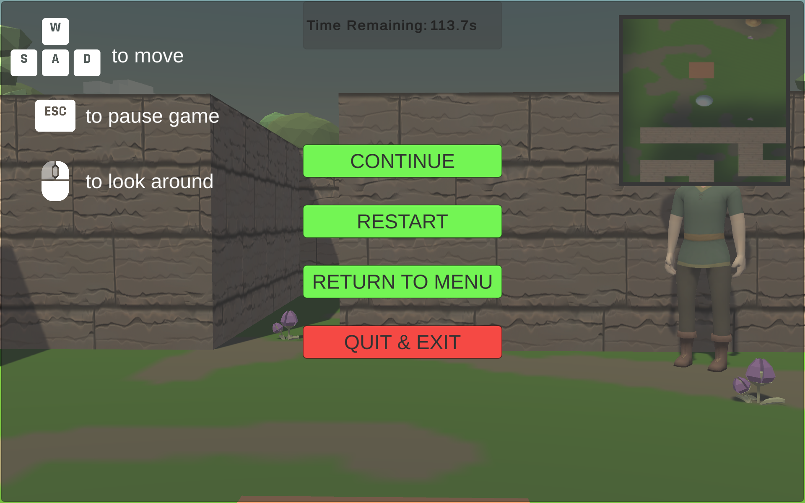

# IM2073 Game Programming Mini-Project
## Amazement Park
> Done by Avisena Gibraltar & Seaw Zhi Yi
### Description
Randomly generated 3D 29x29 (adjustable) maze game in which objective is to exit the maze in given time of 2 minutes (adjustable). Collecting flowers found across the maze increases time remaining by 1 second (adjustable)

Files in GitHub are for the Build of the game project, full unity project files with prefabs & scenes too large
